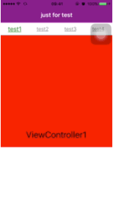
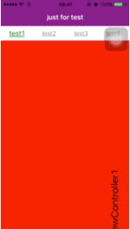
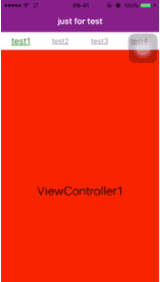

##Swipable  
---  

  


---
###Swipable是什么  
Swipable实现了类似于网易新闻的标签选择页，只需要几行代码便可以集成,具体的使用方法参考Demo。  

---
###Swipable的实现的方法  
Swipable是利用TableView来实现的，每个cell对应着一个ViewController的view(如以下代码所示)；然后利用旋转实现。

```  
- (UITableViewCell *)tableView:(UITableView *)tableView cellForRowAtIndexPath:(NSIndexPath *)indexPath
{
        UITableViewCell *cell = [self.tableView dequeueReusableCellWithIdentifier:kHorizonalCellID forIndexPath:indexPath];
        cell.contentView.transform = CGAffineTransformMakeRotation(M_PI_2);
        cell.contentView.backgroundColor = [UIColor colorWithRed:235.0/255 green:235.0/255 blue:243.0/255 alpha:1.0];
        cell.selectionStyle = UITableViewCellSeparatorStyleNone;
        
        UIViewController *controller = _controllers[indexPath.row];
        controller.view.frame = cell.contentView.bounds;
        [cell.contentView addSubview:controller.view];
        
        return cell;
}
```

当没有旋转时：    
  
TableView进行旋转90度：  
   
TableView中的每个cell旋转90度：  
     

到此，Swipable便实现了。  

---  

###CocoaPods  
你可以在 Podfile 中加入下面一行代码来使用Swipable框架。
```
pod 'TabSwipable', '0.0.2'  
```

欢迎大家提高pull request，希望大家star；

###Thanks  
@开源中国：这个框架是在`开源中国ios客户端`总结出来的，并在此基础上进行了完善，欢迎大家再次进行完善。`开源中国ios客户端`源码地址：`http://git.oschina.net/oschina/iphone-app`。    


